# Valid SA vs EOH Comparison Charts

Valid cells: 43
Improved: 16; Tie: 11; Worse: 16

All charts use cleaned valid comparisons only. `Delta J = EOH J - SA J`; negative values mean EOH is better.

## 01 outcome counts

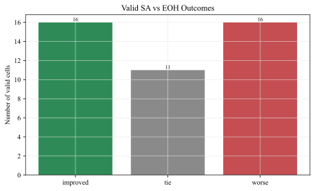

## 02 outcome by density

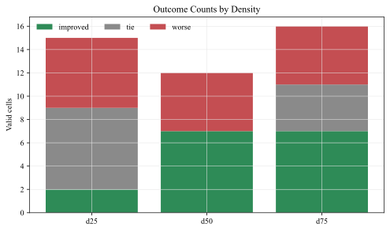

## 03 mean delta by density

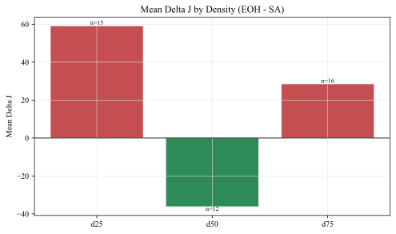

## 04 delta j heatmap all valid

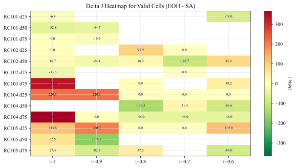

## 05 delta j heatmap rc101

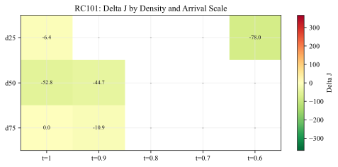

## 05 delta j heatmap rc102

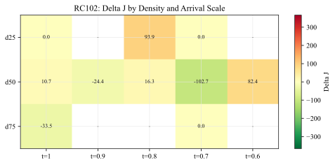

## 05 delta j heatmap rc103

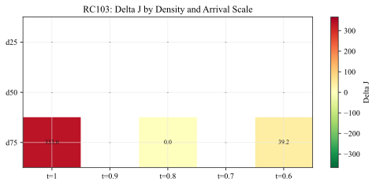

## 05 delta j heatmap rc104

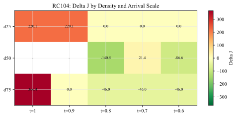

## 05 delta j heatmap rc105

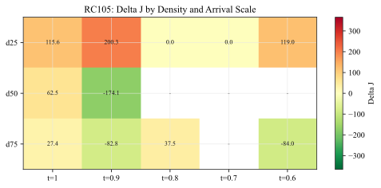

## 06 sa vs eoh j scatter

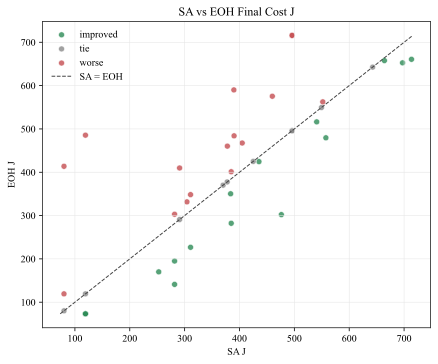

## 07 sa vs eoh res scatter

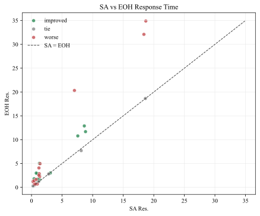

## 08 sorted delta j all valid

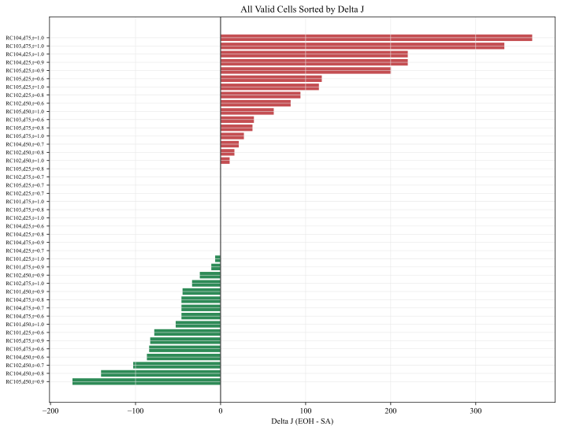

## 09 quality time tradeoff

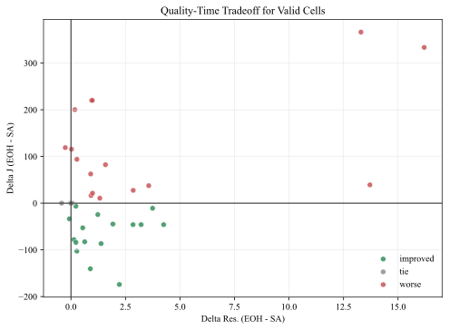

## 10 valid candidates by outcome

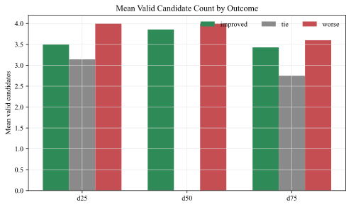

## 11 repeat validation delta j

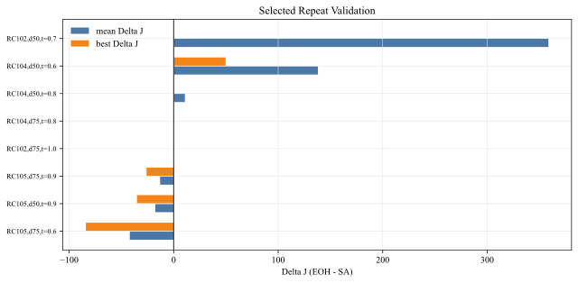
